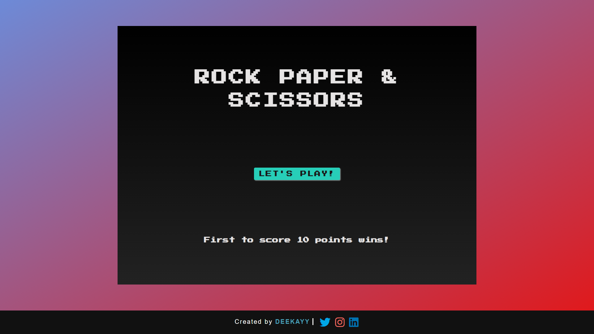

## Rock Paper Scissors - Game with VanillaJs

A rock paper scissiors game created with pure vanilla javascript. The game is pretty advanced. It includes cool animations, modal popups, data storage in form of score and much more. All the modern ES6+ features are used to create the app. The design and functionality is all done by me from scratch.

## Live Preview

[Rock Paper Scissiors - Live Game](https://rockpaperscissor-dk.netlify.app/)

## Tools

- HTML, CSS, and Javascript
- CSS Transitions and Animations
- DOM Manipulation and Traversing the DOM
- Modal Popups
- Arrow Functions [A lot]
- setTimeout Api

## Preview

